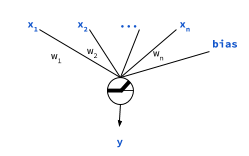

# [fit] Deep Learning Bootcamp
_**Getting Started with Image & Text**_
 
 
 

**Amit Kapoor** [@amitkaps](http://amitkaps.com)
**Bargava Subramanian** [@bargava](http://bargava.com)
**Anand Chitipothu** [@anandology](http://anandology.com)

---

# Bootcamp Approach

- **Domain**: Image & Text
- **Applied**: Proven & Practical
- **Intuition**: Visualisation & Analogies 
- **Code**: Learning by Doing
- **Math**: Attend HackerMath!

---

# Learning Paradigm

---

# Learning Types

- **Supervised**: Regression, Classification, ...
- Unsupervised: Dimensionality Reduction, Clustering, ...
- Self-supervised
- Reinforcement

---

# Learning Approach

 

---

# Data Representation: Tensors

- Numpy arrays (aka Tensors)
- Generalised form of matrix (2D array)
- Attributes
    - Axes or Rank: `ndim` 
    - Dimensions: `shape` e.g. (5, 3) 
    - Data Type: `dtype` e.g. `float32`, `uint8`, `float64`

---

# Tensor Types

- **Scalar**: 0D Tensor
- **Vector**: 1D Tensor
- **Matrix**: 2D Tensor
- **Higher-order**: 3D, 4D or 5D Tensor

---

# Input X

| Tensor |  Example |  Shape                |
|:-------|:---------|:----------------------|
| 2D     | Tabular  | (samples, features)    |
| 3D     | Sequence | (samples, steps, features)    |
| 4D     | Images   | (samples, height, width, channels)    |
| 5D     | Videos   | (samples, frames, height, width, channels)    |

---

# Learning Unit

- weights
- activation: **RELU** `f(x) = max(x,0)`

$$
y = activation(dot(w,x) + b)
$$

---

# Model Architecture 

Model: Sequential

Core Layers
- Dense Layers: Fully connected layer of learning units
- Flatten
- Reshape
- ...

---

# Output y & Loss

| Tensor |  Last Layer |  Loss Function      |
|:-------|:---------|:----------------------|
| Binary Class     | sigmoid  | Binary Crossentropy |
| MultiClass     | softmax | Categorical Crossentropy   |
| MultiClass Multi Label     | sigmoid   | Binary Crossentropy    |
| Regression     | None   | Mean Square Error   |
| Regression (0-1)    | sigmoid   | MSE or Binary Crossentropy   |

---

# Optimizer

- SGD
- RMSProp
- Adam

---

# Best Practices

---

## Pre-processing
- **Normalize** / **Whiten** your data
- **Scale** your data appropriately (for outlier)
- Handle **Missing Values** - Make them 0 (Ensure it exists in training)
- Create **Training & Validation Split**
- **Stratified** split for multi-class data
- **Shuffle** data for non-sequence data. Careful for sequence!!

---

## General Architecture
- Use **ADAM** Optimizer
- Use **RELU** for non-linear activation
- Add **Bias** to each layer
- Use **Xavier** or **Variance-Scaling** initialisation
- Refer to output layers activation & loss function guidance

---

## Dense Architecture
- No. of units reduce in deeper layer
- Units are typically 2^n

## CNN Architecture
- Max 64 or 128 filters
- Increase **Convoluton filters** as you go deeper in 32 -> 64 -> 128
- Use **Pooling** to subsample: Makes image robust from translation, scaling, rotation

---

## Learning Process
- **Validation Process**
    - Hold-Out Validation: Large Data
    - K-Fold (Stratified) Validation: Smaller Data
- **For Underfitting**
  - Add more layers: **go Deeper**
  - Make the layers bigger: **go wider**
  - Train for more epochs
- **For Overfitting**
  - Get **more training data** (e.g. Actual or image augmentation)
  - Reduce **Model Capacity**
  - Add **weight regularisation** (e.g. L1, L2)
  - Add **Dropouts**
  - 

---

## Supervised Learning
- **Classification**: e.g. Image, Text, Speech, Language Translation
- **Sequence generation**: Given a picture, predict a caption describing it. 
- **Syntax tree prediction**: Given a sentence, predict its decomposition into a syntax tree.
- **Object detection**: Given a picture, draw a bounding box around certain objects inside the picture. 
- **Image segmentation**: Given a picture, draw a pixel-level mask on a specific object.

---

## Other Learning
- **Auto-encoder**: 
- **Generative Adversial Network**: Images
- **Reinforcement Learning**: Self-Driving Car, Robots, Education